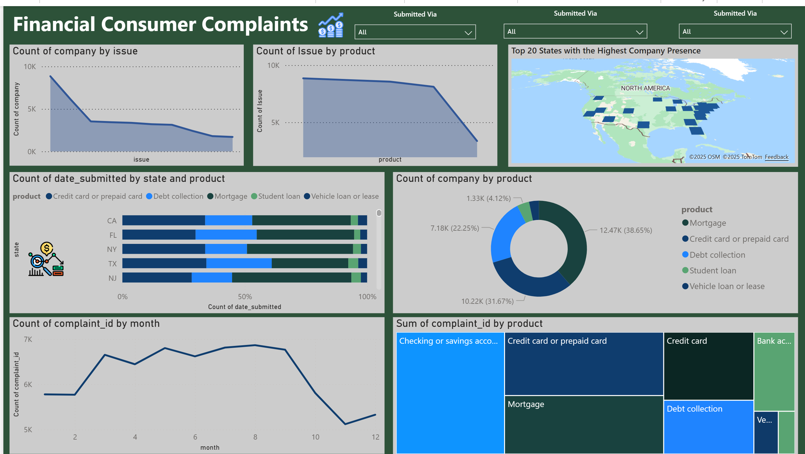
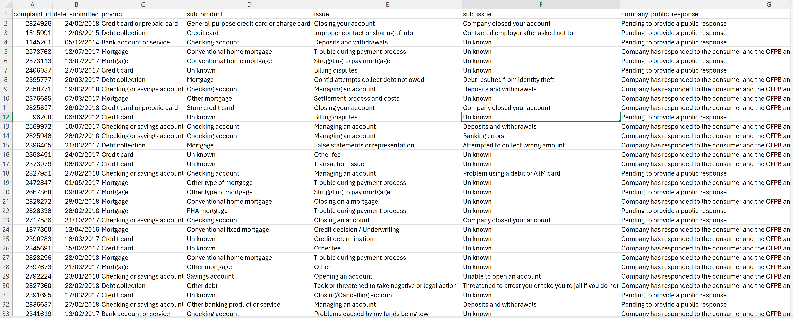

<h3>Introduction</h3> 
This project is for analyzing the Financial-Consumer dataset. The aim is to derive insightful analytics and facilitate data-driven decision-making.

<h3 align="left">📊 Financial Consumer Dashboard</h3>

  

This dashboard is an interactive tool designed to give a historical overview of countries' performance in the financial consumer sector. It presents data in an engaging and accessible way, making complex information easier to digest and understand.

 
 

<h3>🧮 Dataset Overview</h3>

  

  The dataset used in this project is a comprehensive collection of consumer financial data. It provides valuable insights into consumer trends and financial behaviors across various countries.

 

<h2>🔍 EDA – Financial Consumer Data Notebook</h2>

  This notebook focuses on <strong>Exploratory Data Analysis (EDA)</strong> and <strong>data cleaning</strong> 
  of financial consumer data, preparing it for accurate KPI reporting and Power BI visualization.

<h3>🧭 Steps Performed</h3>

<ul>
  <li>📦 <strong>Dropping unnecessary columns</strong> to streamline the dataset and remove redundant information.</li>
  <li>🔄 <strong>Replacing missing values</strong> to maintain data integrity and analytical consistency.</li>
  <li>🧹 <strong>Removing duplicates</strong> to ensure unique and reliable records.</li>
  <li>🧩 <strong>Applying data wrangling techniques</strong> (renaming, filtering, encoding) to prepare the data for modeling.</li>
  <li>📊 <strong>Uploading the final cleaned dataset to Power BI</strong> for KPI visualization and dashboard development.</li>
</ul>
 

<h2>📊 Key Insights and Findings</h2>

  In-depth analysis of our <strong>Financial Consumer Data</strong> revealed critical insights that guide strategic decisions 
  and highlight key performance drivers across our business segments.

<ul>
  <li>
    <strong>📈 Steady Revenue Growth:</strong> Over the past year, the company has demonstrated consistent revenue growth — 
    a promising indicator of <em>financial stability</em> and <em>market strength</em>.
  </li>

  <li>
    <strong>🧩 Customer Segmentation:</strong> The majority of revenue is driven by the 
    <em>"High-Value"</em> customer segment. Understanding their preferences is essential 
    for future <em>personalized marketing</em> and retention strategies.
  </li>

  <li>
    <strong>💼 Product Performance:</strong> <em>Investment Portfolio A</em> has consistently outperformed 
    other products in returns and customer satisfaction. Prioritizing optimization of this product 
    can further increase <em>profitability</em> and <em>brand loyalty</em>.
  </li>

  <li>
    <strong>🌍 Regional Distribution:</strong> Revenue is concentrated in major urban areas. 
    <em>Expansion into suburban and rural markets</em> presents an untapped growth opportunity.
  </li>

  <li>
    <strong>📅 Seasonal Trends:</strong> Revenue spikes occur during the <em>tax season</em> 
    and <em>year-end financial planning periods</em>. Targeted marketing campaigns during these times 
    can further amplify revenue.
  </li>

  <li>
    <strong>⭐ Customer Feedback:</strong> Clients report an average satisfaction rating of <strong>4.8 / 5</strong>. 
    This reflects <em>strong customer trust</em> and <em>service excellence</em> across financial products.
  </li>

  <li>
    <strong>⚔️ Competitive Landscape:</strong> The company’s <em>pricing strategy</em> remains competitive, 
    and service quality continues to differentiate us from peers. Continuous <em>market monitoring</em> 
    will sustain our competitive edge.
  </li>
</ul>

  These insights form the foundation for a <strong>data-driven financial consumer strategy</strong> — 
  enabling better <em>portfolio optimization, customer engagement, and long-term profitability.</em>

 

<h2>🤝 Contributions</h2>

  We welcome and appreciate all <strong>contributions</strong> to improve this project.  
  Whether it’s enhancing the analysis, optimizing code, improving documentation, or suggesting 
  new KPIs — your input helps make this financial analytics project stronger.

