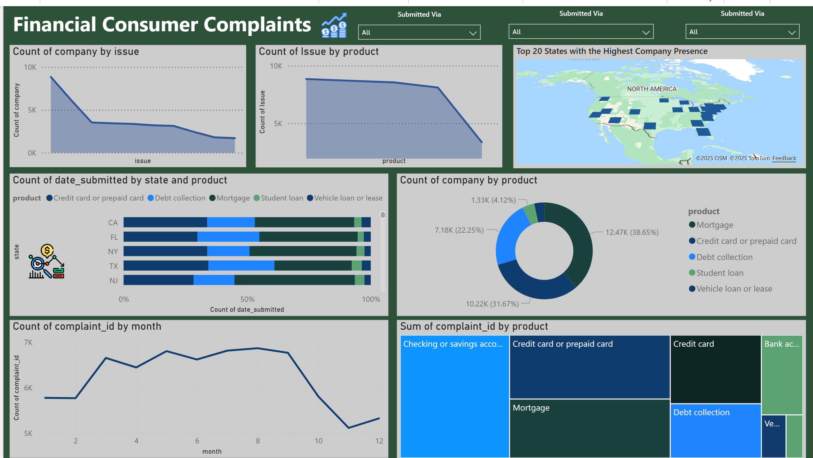

# Financial Consumer Analytics Dashboard

## 📊 Overview
This project delivers a business-ready analytics solution for a financial services organization to understand **revenue drivers, customer segments, and regional performance**.  
The solution replaces manual reporting with an automated, interactive **Power BI dashboard** to support faster and more informed decision-making.

---

## 🎯 Business Problem
The organization relied on manual, static reports that required **40+ hours per month** to prepare and provided limited drill-down capabilities.

Stakeholders needed a centralized analytics view to:
- Identify high-value customer segments  
- Evaluate product performance  
- Detect regional growth opportunities  
- Monitor key financial KPIs in near real time  

---

## 🛠️ Technical Approach
- Cleaned and prepared **50K+ financial consumer records** using **Python (pandas)**, resolving missing values, duplicates, and data inconsistencies.
- Performed customer segmentation and revenue analysis using **SQL and Python** to identify high-value segments and top-performing products.
- Built an **interactive Power BI dashboard** with drill-downs by region, product, and customer segment.
- Automated data refresh to eliminate manual reporting and enable continuous KPI monitoring.

---

## 📈 Business Impact

| Area | Outcome |
|-----|--------|
| **Reporting Efficiency** | Reduced manual reporting effort by **40+ hours per month** |
| **Revenue Visibility** | Identified high-value customers generating **~60% of total revenue** |
| **Product Strategy** | Highlighted Investment Portfolio A as the highest ROI product |
| **Market Expansion** | Revealed underserved suburban regions with **~30% growth potential** |

---

## 🔑 Key Insights
- **Customer Concentration:** ~20% of customers account for ~60% of total revenue, emphasizing targeted retention strategies.
- **Product Performance:** Investment Portfolio A consistently outperforms other offerings in revenue and customer satisfaction.
- **Regional Trends:** Revenue is concentrated in urban regions, highlighting growth opportunities in suburban markets.

---

## 📊 Dashboard Preview

### Dashboard Capabilities
- Revenue trends by month, quarter, and year  
- Customer segmentation with drill-through analysis  
- Regional performance comparison  
- Product-level revenue and performance analysis  

---

## 🧰 Tools Used
- **Python (pandas)** — data cleaning and preparation  
- **SQL** — analytical queries and segmentation  
- **Power BI** — data modeling, DAX measures, and interactive dashboards  

---

## 📌 Notes for Reviewers
This project reflects real-world **financial analytics and BI workflows**, with a strong focus on **business outcomes** rather than exploratory analysis.  
All insights are designed to support **executive and operational decision-making**.
